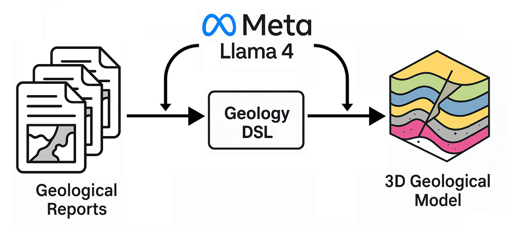

# hutton-lm

A prototype language model interface for generating geological models\!



## Description

Leveraging the power of [Llama 4](https://ai.meta.com/blog/llama-4-multimodal-intelligence/) and [GemPy](https://www.gempy.org/), `hutton-lm` is a Python package designed for generative geology. It utilizes the latest advancements in large language models to understand geological information and translate it into 3D geological models.

## Functionality

`hutton-lm` employs Llama 4's multi-modal inference capabilities to automate the process of creating geological models from existing documentation. The workflow involves the following key steps:

1.  **Document Understanding:** The package can process geology reports and documents by reading OCRed text and interpreting extracted maps.
2.  **Geological Knowledge Consolidation:** The interpreted information for a specific locality is then consolidated into a structured "geology DSL" (Domain Specific Language). This DSL encodes crucial geological knowledge, including:
      * Lithology data (rock types and their properties)
      * Structural interpretations (faults, folds, unconformities)
      * Cross-cutting relations between geological units
      * Relative and absolute time-ordering of geological events.
3.  **3D Model Generation:** Finally, the geology DSL is parsed and used as input for [GemPy](https://www.gempy.org/), an open-source Python library for implicit geological modeling and 3D visualization. This allows for the automatic generation of 3D representations of subsurface geology.

## Examples


## Installation

`hutton-lm` is a Python package managed with Poetry. To set up your environment, ensure you have Poetry installed. If not, you can install it following the instructions on the [official Poetry website](https://python-poetry.org/).

Once Poetry is installed, navigate to the directory containing the `pyproject.toml` file and run:

```bash
poetry install
```

This command will create a virtual environment and install all the necessary dependencies, including GemPy.

## To Run

Before running the example script, you'll need to set your Llama 4 API key as an environment variable:

```bash
export LLAMA_API_KEY=<your-key-here>
```

Replace `<your-key-here>` with your actual Llama 4 API key.

The provided example script `run.py` demonstrates how to initiate the geological modeling process using Llama 4. To run it, use the following command:

```bash
python run.py \
    --input-mode llm \
    --prompt-type default \
    --llm-output-dir input-data/llm-generated
```

This command will instruct the script to use the language model (`--input-mode llm`) with a default prompting strategy (`--prompt-type default`) and save the LLM's output (the generated geology DSL) to the `input-data/llm-generated` directory.

## Contributing

We welcome contributions to `hutton-lm`\! If you have ideas for improvements, new features, or bug fixes, please feel free to open an issue or submit a pull request.

